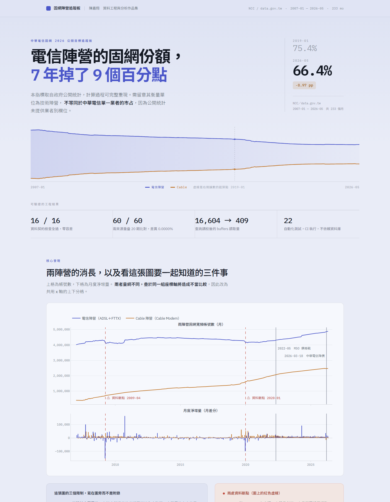

# 固網陣營追蹤板 — 公開資料查得到什麼、查不到什麼

用政府開放資料追蹤台灣固網寬頻市場，並誠實交代中華電信 2026 年公開宣布的四個目標裡，
這份資料**一個都追不到**。



<sup>**▶ [開啟線上看板](https://raymond-chen-das.github.io/broadband-dashboard/)**
（互動版）。由 `src/build_dashboard.py` 產生；`dashboard/index.html` 是同一頁，可離線開啟。</sup>

## 這是什麼

2026 年 3 月，中華電信個人家庭分公司公開了四個固網目標。本專案只用公開資料去追蹤這四項，
結果是四項都追不到——而這個結果就是交付物本身。

公開資料**確實**看得到的那件事：

> **電信陣營占兩陣營合計帳號數的比例，從 2019-01 的 75.37% 降到 2026-05 的 66.40%，
> 七年下降 8.97 個百分點。**（分母＝電信＋Cable 兩陣營；Leased Line 不計，
> 其量級僅千餘帳號，對占比影響 < 0.02 pp）

數字會隨上游更新而動；`src/update_monthly.py` 會重跑整條管線，
而頁面上每一個顯示值都是算出來的，沒有寫死。回歸錨點固定在 2019-01 的 75.37%
與 2026-04 的 66.36%（−9.01 pp），測試對這兩個錨點精確斷言。

| # | 公開目標 | 追得到嗎 | 缺什麼 |
|---|---|---|---|
| 1 | 寬頻淨增 7 萬戶 | ⚠️ 僅陣營層級 | 公開統計無業者別 |
| 2 | 市占守住 51% | ⚠️ 僅代理指標 | 分母有，**分子沒有** |
| 3 | 300M 以上占比破 50% | ❌ | 無任何公開的方案速率分佈 |
| 4 | Wi-Fi 全屋滲透 65% | ❌ | 純內部指標 |

## 方法

兩份 NCC 統計，經 `data.gov.tw` 發布，月頻率、依接取技術別：

| 來源 | 粒度 | 期間 | 狀態 |
|---|---|---|---|
| `7164` 寬頻上網帳號數 | 技術別 × 月 | 2019-01 → 現行 | 仍更新 |
| `27953` 有線寬頻用戶數 | 技術別 × 月 | 2007-01 → 2020-08 | 已停更 |

1. **契約驗證先於一切** — 欄位、列數、去除千分位逗號後是否為非負整數、小計算術、
   月份連續性、期間範圍。共 16 項，任一項未通過即中止後續所有階段。
2. **接合校驗** — 兩份來源重疊 20 個月。三個可比欄位逐月比對。
   5% 的放棄門檻**在看資料之前**就寫進 `logs/decisions.log`（append-only）。
3. **落庫** — PostgreSQL 17 星型 schema（`fact_subscriptions_monthly`、
   `dim_technology`、`dim_period`），冪等 upsert，以逐列 MD5 驗證。
4. **指標** — 在 PostgreSQL 內以視窗函數計算，不撈回 Python 算。
5. **看板** — 單頁 HTML（Plotly），可離線開啟。

**預先登記。** 所有閾值、陣營歸類、outcome 指標與接合規則，都在檢視資料之前寫下並標上時間戳。
該檔 append-only。這是防止結果出來後才悄悄調整判準的唯一機制。

**不做因果宣稱。** 四種識別策略各自被一個具體事實擋掉，理由記於
`docs/decision-trail.md` 並複述於看板的方法說明頁。圖上的事件時點只是視覺標記，
不估計任何效果。

## 如何重跑

需要 Docker 與 Python 3.13。

```bash
docker compose up -d                                   # PostgreSQL 17，127.0.0.1:5432
py -3.13 -m venv .venv
.\.venv\Scripts\python.exe -m pip install -r requirements.txt

.\.venv\Scripts\python.exe src\validate_contracts.py   # 階段 1：16 項契約檢查
.\.venv\Scripts\python.exe src\splice_check.py         # 階段 2：20 期重疊校驗
.\.venv\Scripts\python.exe src\load_postgres.py --verify  # 階段 3：落庫＋冪等驗證
.\.venv\Scripts\python.exe src\compute_metrics.py      # 階段 4：指標＋自檢
.\.venv\Scripts\python.exe src\build_dashboard.py      # 階段 5：dashboard/index.html
.\.venv\Scripts\python.exe -m pytest -q                # 測試
```

看板從自己的目錄載入 `plotly.min.js`，所以只要整個資料夾在一起就能離線開啟。
`build_dashboard.py --inline` 會產生約 4.7MB 的單一自足檔案，供單獨寄送；
該版本刻意不進版控，因為月更新管線每月都會重生看板，每次都會多一個數 MB 的 blob。

選用：`src\db_experiments.py`（資料庫調校實驗，會建一張明確標示為合成的約 200 萬列測試表）、
`src\update_monthly.py`（月更新管線）。

## 結果

| | |
|---|---|
| 契約檢查 | **16/16 通過**，零容差 |
| 接合重疊 | 20 個月 × 3 欄 = **60/60 完全相等**，差異中位數與最大值皆 **0.0000%** |
| 落庫列數 | 1,165（233 個月 × 5 技術別），2007-01 → 2026-05 |
| 冪等 | 第二次執行完全相同：列數、總和、**以及逐列 MD5** |
| 電信陣營占比 | 75.37%（2019-01）→ 66.40%（2026-05），**−8.97 pp** |
| 查詢調校 | Parallel Seq Scan → Index Only Scan，buffers **16,604 → 409**（合成 200 萬列基準表） |
| 索引寫入代價 | 索引 2→5 之後，upsert 中位數 **2.21s → 3.15s** |
| 測試 | **22 項通過**，不依賴資料庫，CI 執行 |
| 月更新管線 | 對真實新月份端到端實跑：2026-04 → 2026-05；再跑一次正確回報「上游尚未發布新月份」 |

**關於 0.0000% 的接合結果**：20 期完全一致，比起「兩個獨立來源互相驗證」，
更合理的解釋是兩份資料出自同一份上游 NCC 報表。因此全文一律表述為
**「同源確認，可安全接合」**，不寫成交叉驗證。

## 驗證路徑

進入交付物的每個數字都有兩條路徑：一條產生它，另一條獨立驗證它。這個設計不是一開始就有的。

早期的檢查由產生流程自己回報結果——那樣的檢查會放過它本來該擋下的東西。兩個實例：
看板的主要數字一度是寫死的字面值，而這個專案的前提正是每個數字都由資料算出；
把 Plotly 改成外部引用讓頁面變小，圖卻變成空白。
**兩次都是在把產出擺到人眼前的那一刻才發現的。**

因此驗證一律不經過產生流程：Ground Truth 自檢、逐列 MD5、渲染後截圖回看、
預先登記的日誌、拿已知會失敗的輸入重跑每個新檢查。CI 也屬於這條路徑——
契約一度還在要求它被寫下那天的快照，管線推進一個月就紅了。

## 限制

1. **技術別 ≠ 業者別。** FTTX 含台灣大與遠傳，中華電信自身的貢獻無法分離。
   同理，**若有線電視業者佈建的 FTTH 依技術別歸入 FTTX 欄**，本分析會系統性低估
   Cable 陣營的實際份額——**亦即電信陣營的份額變化可能比觀測到的更大**。
   NCC 的填報規則未經查證，也無法用本資料驗證；**此一偏誤的方向對本文結論為保守。**
2. **帳號數 ≠ 用戶數。** 一戶可能有多個帳號，一個帳號也可能對應多人。
3. **不做因果宣稱。** 事件時點只是標記，不估計處理效果。
4. **接合的殘餘不確定性。** 0.0000% 代表同源而非互證——兩份共同的系統性偏誤，
   無法用彼此檢出。
5. **事件時點僅為視覺標記** — 2022-05 MSO 價格戰、2026-03-18 中華電信降價。
6. **兩處無法解釋的斷點。** 2009-04 與 2020-01 各出現一次單月劇變，次月即回歸原趨勢。
   2020-01 落在重疊期內，**兩份來源報一模一樣的數字**，所以是上游而非接合造成。
   為確認成因查了三個來源（資料集中繼資料、NCC 官網——HTTP 403、公開搜尋），皆無所獲。
   **成因未能證實，本專案也不宣稱。** 若 2020-01 確為定義變更，則七年降幅中約 **12%**
   屬定義效果而非市場變化，其餘約 −7.9 pp 仍成立。
7. **基準數字不是生產數字。** 資料庫實驗跑在單台筆電的 Docker 容器內。
   四次執行的牆鐘時間比值在 2.3×–9.5× 之間跳動，而 buffers 每次都一樣——
   只有同環境下的前後對照有意義，而該信的是 buffers。
8. **Teradata 刻意不做。** 理由見 `docs/20-db-experiments.md`。

## 目錄

```
src/       管線：sources → 契約 → 接合 → 落庫 → 指標 → 看板
docs/      規格、決策軌跡（append-only）、資料庫實驗、接合校驗報告
logs/      預先登記（append-only）、原始量測值、月更新執行紀錄
data/raw/  兩份來源 CSV，未經修改
dashboard/ 產生的看板（index.html + plotly.min.js）與摘要頁
tests/     契約與 Ground Truth 測試
```

外部求職者以公開資料製作。非中華電信文件，不代表該公司立場。
