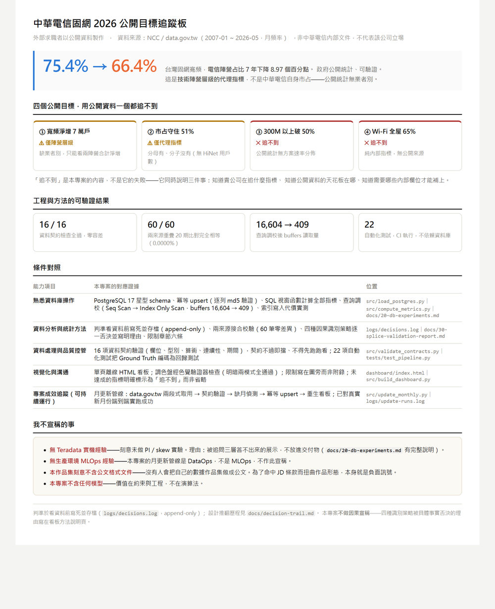

# Broadband Camp Tracker — auditing what public data *can't* tell you

Taiwan's fixed broadband market, tracked from open government data — and an honest
account of the four publicly announced 2026 targets that this data **cannot** track.


<sup>**▶ [Open the live dashboard](https://raymond-chen-das.github.io/broadband-dashboard/)**
— interactive, works on a phone. Generated by `src/build_dashboard.py`;
`dashboard/index.html` is the same page and opens offline.</sup>

## What

In March 2026 Chunghwa Telecom's Consumer Business Group announced four fixed-broadband
targets. This project tries to track all four using only public data, and reports the
result plainly: **none of them can be tracked directly.**

That negative result is the deliverable, not a failure of it. It demonstrates three
things at once: knowing which metrics the business actually steers by, knowing exactly
where open data runs out, and knowing which internal fields would close the gap.

The one thing public data *does* show, and shows clearly:

> **The telco camp's share of Taiwan's fixed broadband accounts fell from 75.37% (2019-01)
> to 66.40% (2026-05) — 8.97 percentage points over seven years.**

Figures move as the upstream dataset updates; `src/update_monthly.py` refreshes everything
and every displayed number is computed, never hard-coded. The pinned regression anchors are
75.37% at 2019-01 and 66.36% at 2026-04 (−9.01 pp), which the test suite asserts exactly.

| # | Announced target | Trackable? | What's missing |
|---|---|---|---|
| 1 | +70,000 net broadband subscribers | ⚠️ camp level only | no per-operator breakdown in public stats |
| 2 | Hold 51% market share | ⚠️ proxy only | denominator yes, **numerator no** |
| 3 | 300M+ plans above 50% | ❌ | no plan-speed distribution published anywhere |
| 4 | Whole-home Wi-Fi at 65% | ❌ | internal-only metric |

## Method

Two NCC datasets published via `data.gov.tw`, monthly, by access technology:

| Source | Grain | Coverage | Status |
|---|---|---|---|
| `7164` broadband accounts | technology × month | 2019-01 → current | live |
| `27953` cable broadband subscribers | technology × month | 2007-01 → 2020-08 | frozen |

1. **Contract validation before anything else** — columns, row counts, non-negative
   integers after stripping thousands separators, subtotal arithmetic, month continuity,
   period range. 16 checks; nothing proceeds unless all pass.
2. **Splice validation** — the two sources overlap by 20 months. All three comparable
   columns are compared month by month. The 5% abandon threshold was written down
   *before looking at the data* (`logs/decisions.log`, append-only).
3. **Load** — star schema in PostgreSQL 17 (`fact_subscriptions_monthly`,
   `dim_technology`, `dim_period`), idempotent upsert verified by a row-level MD5.
4. **Metrics** — computed *in* PostgreSQL with window functions, not pulled into Python.
5. **Dashboard** — single self-contained HTML page (Plotly, works offline).

**Pre-registration.** Every threshold, the camp mapping, the outcome metrics and the
splice rule were fixed and timestamped before the data was examined. The file is
append-only. This is the only real defence against quietly moving the goalposts once
results are visible.

**No causal claims.** Four identification strategies were each killed by a specific
fact, documented in `docs/decision-trail.md` and restated on the dashboard. Event dates
appear as visual markers only; no effect is estimated.

## Reproduce

Requires Docker and Python 3.13.

```bash
docker compose up -d                                   # PostgreSQL 17 on 127.0.0.1:5432
py -3.13 -m venv .venv
.\.venv\Scripts\python.exe -m pip install -r requirements.txt

.\.venv\Scripts\python.exe src\validate_contracts.py   # stage 1 — 16 contract checks
.\.venv\Scripts\python.exe src\splice_check.py         # stage 2 — 20-month overlap
.\.venv\Scripts\python.exe src\load_postgres.py --verify  # stage 3 — load + idempotency
.\.venv\Scripts\python.exe src\compute_metrics.py      # stage 4 — metrics + self-check
.\.venv\Scripts\python.exe src\build_dashboard.py      # stage 5 — dashboard/index.html
.\.venv\Scripts\python.exe -m pytest -q                # tests
```

The dashboard loads `plotly.min.js` from its own directory, so it opens offline as long
as the folder stays together. `build_dashboard.py --inline` produces a single
self-contained ~4.7 MB file instead, for emailing or uploading on its own — that variant
is deliberately not committed, because the monthly pipeline regenerates the dashboard and
would add a fresh multi-megabyte blob to history every time.

Optional: `src\db_experiments.py` (database tuning experiments — builds a clearly
labelled ~2M-row synthetic table), `src\update_monthly.py` (monthly refresh pipeline).

## Results

| | |
|---|---|
| Contract checks | **16/16 pass**, zero tolerance used |
| Splice overlap | 20 months × 3 columns = **60/60 exactly equal**, median and max diff **0.0000%** |
| Rows loaded | 1,165 (233 months × 5 technologies), 2007-01 → 2026-05 |
| Idempotency | second run identical: row count, sum, **and row-level MD5** |
| Telco camp share | 75.37% (2019-01) → 66.40% (2026-05), **−8.97 pp** |
| Query tuning | Parallel Seq Scan → Index Only Scan, buffers **16,604 → 409** |
| Index write cost | upsert median **2.21s → 3.15s** after 2→5 indexes |
| Tests | **22 pass**, database-free, run in CI |
| Monthly pipeline | run end-to-end against live data: 2026-04 → 2026-05, then correctly reported "no new month" on the next run |

**On the 0.0000% splice result:** 20 periods agreeing *exactly* is much better explained
by both datasets originating from the same upstream NCC report than by two independent
sources corroborating each other. It is described throughout as
**"same-source confirmation, safe to splice"** — never as cross-validation.

## What this project got wrong first

Six times during the build, a check claimed more rigour than it actually performed:
tolerance cases folded into a pass count; a comment promising row-by-row comparison
that only compared totals; `EXPLAIN` buffer counts double-added across plan nodes,
inflating a figure six-fold; a hard-coded headline figure in a dashboard whose whole
premise is that every number is derived; the same hard-coded figure written again
ten minutes later in a second file; a switch to an external Plotly file that shrank
the page and silently emptied the chart.

**Every one surfaced at the moment the output was put in front of a person** — a
rendered screenshot, a checksum, a known-bad input replayed through a new check. CI
caught a seventh: the contract still demanded the snapshot it was pinned to on the
day it was written, and failed the first time the pipeline advanced a month.

The conclusion is not "be more careful". It is that **any number reaching a
deliverable needs a verification path independent of the code that produced it.**
That is why the Ground Truth self-check, the row-level MD5, the rendered-output
screenshots and the pre-registered log all exist here.

## Limitations

1. **Technology ≠ operator.** FTTX includes Taiwan Mobile and FarEasTone; Chunghwa
   Telecom's own contribution cannot be separated out.
2. **Accounts ≠ subscribers.** One household may hold several accounts; one account may
   serve several people.
3. **No causal claims.** Event dates are markers. No treatment effect is estimated.
4. **Residual splice uncertainty.** 0.0000% agreement means same source, not mutual
   verification — a systematic error common to both cannot be detected by comparing them.
5. **Event markers only** — 2022-05 MSO price war, 2026-03-18 Chunghwa price cut.
6. **Two unexplained discontinuities.** 2009-04 and 2020-01 each show a one-month level
   shift that reverts immediately. 2020-01 falls inside the overlap window and *both*
   sources report identical figures, so it is upstream, not a splice artefact. Three
   sources were checked for a definition change (dataset metadata, NCC site — HTTP 403,
   public search); none found. **The cause is unverified and is not claimed.** If
   2020-01 is a definitional change, roughly **12%** of the seven-year decline is
   definitional rather than market movement; the remaining ≈ −7.9 pp still stands.
7. **Benchmark numbers are not production numbers.** The database experiments run in a
   Docker container on a single laptop. Wall-clock ratios varied 2.3×–9.5× across four
   runs while buffer counts stayed identical — only the same-environment before/after
   comparison is meaningful, and buffers are the metric to trust.
8. **Teradata was deliberately left out.** See `docs/20-db-experiments.md` for why.

## One-page summary

For screening. `dashboard/onepager.html`, printable to A4 (`dashboard/onepager.pdf`).
Every figure on it is derived from the data, not typed in.



## Layout

```
src/       pipeline: sources → contracts → splice → load → metrics → dashboard
docs/      spec, decision trail (append-only), database experiments
logs/      pre-registration (append-only), raw experiment measurements
data/raw/  the two source CSVs as downloaded
dashboard/ generated dashboard (index.html + plotly.min.js), one-page summary + PDF
tests/     contract and Ground Truth tests
```

Produced by an external applicant from public data. Not a Chunghwa Telecom document and
not a statement of that company's position.
